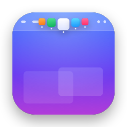

<p align="center">
  
</p>

<h1 align="center">TopDock</h1>

<p align="center">Your Dock, in the middle of the menu bar.</p>

TopDock is a tiny native macOS app (Swift, AppKit + SwiftUI) that puts a compact Dock into the
empty center of the menu bar, so you can hide the real Dock and still switch apps with one click.

## Features

- **Fits the space that's actually free.** TopDock measures the gap between the frontmost app's
  menus and the status items, and recomputes whenever you switch apps.
- **Same order as your Dock.** Finder and the apps you keep in the Dock come first, in the
  Dock's order. After a divider come other running apps and up to 3 of the Dock's recent
  apps, or fewer when space runs out. Rearrange apps in the Dock and TopDock follows.
- **Overflow that doesn't get in the way.** Apps that don't fit collapse into a `+N` chevron
  menu. Scrolling or swiping over the icons pages through the full list.
- **Dock-style magnification** on hover, with the app name shown below the icon.
- **Notch-aware.** On MacBooks with a notch the icons continue from the left side of the notch
  to the right, keeping the Dock's order. Top-center overlays such as notch or
  "dynamic island" apps are treated the same way.
- **Hides with the menu bar**, both for fullscreen apps and with "Automatically hide and show
  the menu bar".
- Running-app dots, a highlight on the active app, and dimmed icons for hidden apps.
- Right-click an icon to Show in Finder, Hide, or Quit (hold ⌥ for Force Quit).
- Multiple displays, launch at login, adjustable icon size, magnification and slot count.
- An optional menu bar icon and an About window linking back to this project.

## Install

1. Download `TopDock-x.y.z.dmg` from the [latest release](https://github.com/djui/topdock/releases/latest).
2. Drag **TopDock** to **Applications**.
3. TopDock isn't notarized, so on first launch right-click the app, choose **Open**, then
   **Open** again. Alternatively, run:

   ```sh
   xattr -dr com.apple.quarantine /Applications/TopDock.app
   ```

4. Optional: grant **Accessibility** access (Settings → Available space → Grant Access…).
   This lets TopDock measure the app menus and status items and use all the free space.
   Without it, TopDock uses a fixed width that you can adjust.

TopDock has no Dock icon of its own. Settings, About and Quit are available from:

- the TopDock icon among the menu bar extras (you can turn it off in Settings),
- right-clicking any icon in the strip, or clicking its chevron,
- launching TopDock again while it's running, which always opens Settings.

> Because releases are ad-hoc signed, macOS treats every new version as a different app, so
> you'll need to re-grant Accessibility access after updating.

## Build from source

Requires Xcode 16 or newer (Swift 6) and macOS 14 or newer. The app lives in the
[`TopDock/`](TopDock) folder; run all commands from there.

```sh
cd TopDock
swift run                 # run a debug build
scripts/bundle.sh         # universal dist/TopDock.app (ad-hoc signed)
scripts/package.sh        # plus dist/TopDock-<version>.zip, .dmg and checksums.txt
```

The app icon is generated in code:

```sh
swift scripts/make-icon.swift dist/AppIcon.iconset
iconutil -c icns dist/AppIcon.iconset -o Resources/AppIcon.icns
```

For visual checks without Screen Recording permission, debug builds render their panels
(idle and hovered) to PNG files:

```sh
swift build && TOPDOCK_SNAPSHOT=/tmp .build/debug/TopDock
```

## Releasing

```sh
scripts/release.sh 0.2.0          # bump version, commit, tag and push; CI publishes
scripts/release.sh 0.2.0 --local  # also build and publish the release from this machine
```

Pushing a `v*` tag runs the [Release workflow](.github/workflows/release.yml), which builds
the app and attaches the DMG, zip and checksums to the GitHub release.

## How it works

- Each strip of icons is a borderless, non-activating `NSPanel` one window level above the
  menu bar, on all Spaces but not on fullscreen Spaces.
- Free space comes from the frontmost app's `AXMenuBar` and the status item frames
  (Accessibility), plus the screen's `auxiliaryTopLeftArea`/`auxiliaryTopRightArea` for the
  notch. TopDock uses public APIs only.

## License

[MIT](LICENSE)
